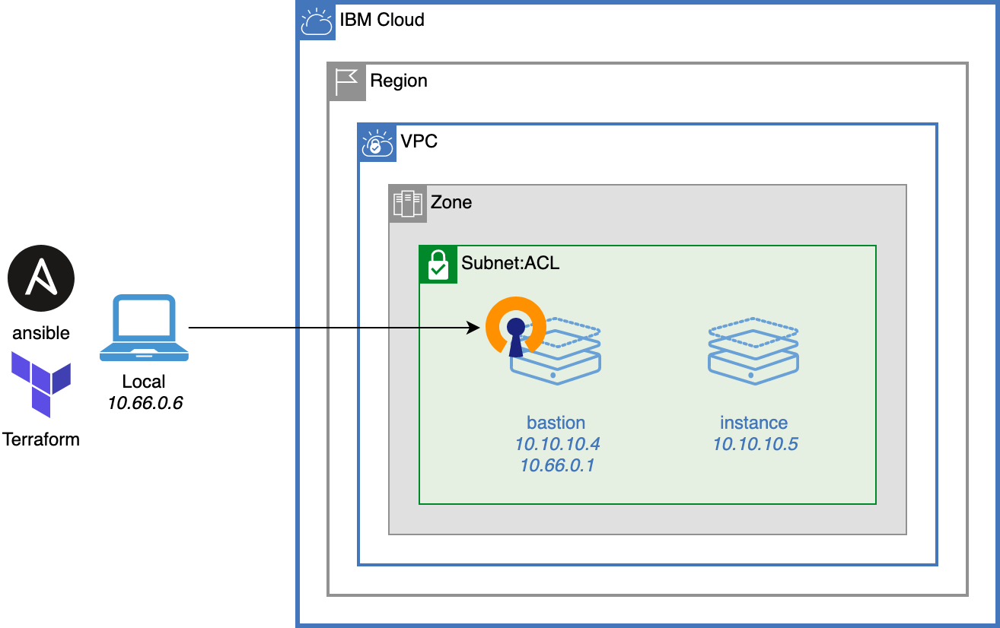

# Use OpenVPN to access virtual server instances running in a virtual private cloud



## Deploy all resources

1. Copy `terraform.tfvars.template` to `terraform.tfvars`:
   ```sh
   cp terraform.tfvars.template terraform.tfvars
   ```
1. Edit `terraform.tfvars` to match your environment.
1. Use the following Docker image to run the deployment scripts. It has all required tools preinstalled.
   ```
   docker run -it --volume $PWD:/root/mnt/home --workdir /root/mnt/home l2fprod/ibmcloud-ci
   ```
1. Load the environment:
   ```
   source local.env
   ```
1. Run `tfswitch` to point to the right Terraform version for this solution:
   ```
   tfswitch
   ```
1. Deploy all resources:
   ```sh
   terraform init
   terraform apply
   ```

## Install OpenVPN on the bastion

1. Change to ansible directory:
   ```
   cd ansible
   ```
1. Install ansible dependencies
   ```
   ansible-galaxy install -r requirements.yml
   ```
1. To confirm ansible configuration, ping all hosts
   ```
   ansible all -m ping -i inventory -v
   ```
1. Install OpenVPN on the bastion
   ```
   ansible-playbook -i inventory playbook-openvpn.yml
   ```

## Connect to OpenVPN

To connect to the VPN, use _OpenVPN Connects_ with the configuration generated in `ansible/client-config/mymachine`:
- https://openvpn.net/client-connect-vpn-for-windows/
- https://openvpn.net/client-connect-vpn-for-mac-os/

or from a command line
   ```
   openvpn --setenv FORWARD_COMPATIBLE 1 --daemon --config ./client-config/mymachine/*-bastion.ovpn
   ```

To view routes on macOS, use `netstat -nr`. On Linux `netstat -ar`.

## Test the OpenVPN connection

Ping one VPC server instance directly from your local machine:
```
ping $(terraform output -json | jq -r '.instance_ips.value[0]')
```

or a COS direct endpoint:
```
ping s3.direct.us.cloud-object-storage.appdomain.cloud
```

or a service private endpoint:
```
ping api.private.us-south.speech-to-text.watson.cloud.ibm.com
```

If you stop the VPN connection, all these ping would fail.

## Destroy all configuration

1. To destroy the environment:
   ```sh
   terraform destroy
   ```
